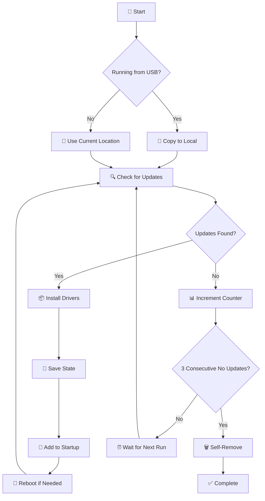

# Windows Driver and Update Tool - Auto-Start Edition

[](https://www.microsoft.com/windows)
[](https://docs.microsoft.com/powershell/)
[](LICENSE)
[](CHANGELOG.md)

## 📋 Table of Contents

- [🎯 Overview](#-overview)
- [✨ Features](#-features)
- [🔧 Installation](#-installation)
- [📱 USB Drive Deployment](#-usb-drive-deployment)
- [🖥️ System Requirements](#️-system-requirements)
- [?? Official Sources](#-official-sources)
- [🚦 How It Works](#-how-it-works)
- [📊 Usage Modes](#-usage-modes)
- [🛠️ Configuration](#️-configuration)
- [📝 Logging & Monitoring](#-logging--monitoring)
- [🔐 Security Features](#-security-features)
- [🆘 Troubleshooting](#-troubleshooting)
- [⚠️ Important Notes](#️-important-notes)
- [📈 Performance](#-performance)
- [🤝 Contributing](#-contributing)

## 🎯 Overview

The **Windows Driver and Update Tool** is an enterprise-grade, fully automated solution for installing Windows updates and drivers on new system builds or existing systems. It automatically installs itself to Windows startup, applies updates, and removes itself when complete. Feature upgrades (e.g., Windows 10 to Windows 11) are excluded. 🎉

### 🌟 Key Highlights

- **🔄 Fully Autonomous** - Set it and forget it! Runs automatically at startup
- **💾 USB Deployment Ready** - Deploy from USB drives to multiple systems
- **🧹 Self-Cleaning** - Removes itself when updates are applied
- **📊 State Persistence** - Survives reboots and continues where it left off
- **🛡️ Enterprise Safe** - Comprehensive error handling and logging

## ✨ Features

### 🎯 Core Functionality

| Feature | Description |
|---------|-------------|
| ?? **Auto-Detection** | Automatically discovers Windows updates and driver updates from Windows Update |
| 📦 **Batch Installation** | Installs multiple updates in a single session |
| 🔄 **Auto-Startup** | Adds itself to Windows startup (Registry + Task Scheduler) |
| 🗑️ **Self-Removal** | Automatically removes itself when no more updates need applying |
| 💾 **USB Support** | Detects USB execution and copies to local drive |
| 📊 **State Management** | Tracks progress across reboots with JSON state file |
| 📝 **Comprehensive Logging** | Detailed logs with rotation and Event Log fallback |
| 🛡️ **Safety Features** | Driver backup, restore points, signature validation |

### 🚀 Advanced Features

- **🔐 Dual Startup Methods** - Uses both Registry and Scheduled Task for reliability
- **⚡ Smart Detection** - Identifies and skips preview/beta drivers
- **🔄 Retry Logic** - Automatic retry with exponential backoff
- **📈 Progress Tracking** - Visual progress bars and status updates
- **🌐 Internet Check** - Validates connectivity before attempting updates
- **💽 Driver Backup** - Exports current drivers before updates
- **🔄 Reboot Management** - Handles required reboots gracefully

## 🔧 Installation

### 📦 Quick Start (Recommended)

1. **Download the package** to any location (USB drive or local folder)
2. **Double-click** `Install-DriverUpdater.cmd`
3. **Accept** the UAC prompt for administrator privileges
4. **Select option 1** to install and configure auto-start
5. ✅ **Done!** The tool will handle everything automatically

### 🎯 Manual Installation

```powershell
# Run PowerShell as Administrator
cd "path\to\driver-updater"

# Execute the auto-start script
.\WindowsDriverUpdater_AutoStart.ps1
```

### 🖱️ One-Click Installation

Simply run `Install-DriverUpdater.cmd` - it handles elevation and execution automatically!

## 📱 USB Drive Deployment

### 🔌 Preparing USB Drive

1. **Format USB** drive (FAT32 or NTFS)
2. **Copy all files** to USB root or subfolder:
   ```
   📁 USB Drive
   ├── 📄 Install-DriverUpdater.cmd
   ├── 📄 WindowsDriverUpdater_AutoStart.bat
   ├── 📄 WindowsDriverUpdater_AutoStart.ps1
   └── 📄 README.md
   ```

3. **Label the USB** (optional): "DRIVER_UPDATER"

### 🚀 Deployment Process

1. **Insert USB** into target system
2. **Navigate to USB** in File Explorer
3. **Run** `Install-DriverUpdater.cmd`
4. **Remove USB** after installation starts (tool copies itself locally)

### 📊 Mass Deployment

For multiple systems:
```batch
@echo off
:: Deploy to multiple systems via network
for %%C in (PC001 PC002 PC003) do (
    echo Deploying to %%C...
    xcopy /E /Y "\\server\share\DriverUpdater\*" "\\%%C\C$\Temp\DriverUpdater\"
    psexec \\%%C -s -d cmd /c "C:\Temp\DriverUpdater\Install-DriverUpdater.cmd"
)
```

## 🖥️ System Requirements

### ✅ Minimum Requirements

| Component | Requirement |
|-----------|-------------|
| 🖥️ **OS** | Windows 10 (1809+) / Windows 11 / Server 2016+ |
| ⚙️ **PowerShell** | Version 5.1 or later |
| 👤 **Privileges** | Administrator rights |
| 🌐 **Network** | Internet connection for driver downloads |
| 💾 **Disk Space** | 500MB free (more for driver backups) |
| 🔧 **Services** | Windows Update service enabled |

### 📋 Prerequisites Check

The tool automatically verifies:
- ✅ Administrator privileges
- ✅ PowerShell version
- ✅ Windows Update service status
- ✅ Internet connectivity
- ✅ Required PowerShell modules
## ?? Official Sources

These references describe the Windows Update and driver update mechanisms used by this tool:

- Windows Update overview: https://support.microsoft.com/windows/update-windows-3c5ae7fc-9fb6-9af1-1984-b5e0412c556a
- Update drivers manually: https://support.microsoft.com/windows/update-drivers-manually-in-windows-ec62f46c-ff14-c91d-eead-d7126dc1f7b6
- Windows Update error reference: https://learn.microsoft.com/windows/deployment/update/windows-update-error-reference
- Windows Update Agent API (WUAPI): https://learn.microsoft.com/windows/win32/api/wuapi/
- PSWindowsUpdate module: https://www.powershellgallery.com/packages/PSWindowsUpdate

## 🚦 How It Works

### 📊 Workflow Diagram



### 🔄 Execution Phases

#### Phase 1: Initialization 🚀
- Checks admin privileges
- Detects USB vs local execution
- Creates working directory
- Initializes logging

#### Phase 2: Setup 🔧
- Installs required PowerShell modules
- Registers Microsoft Update service
- Validates internet connectivity
- Loads previous state (if exists)

#### Phase 3: Update Discovery 🔍
- Queries Windows Update for drivers and updates
- Filters out preview/beta drivers
- Validates driver signatures
- Creates driver list

#### Phase 4: Installation 📦
- Creates driver backup (optional)
- Creates restore point (optional)
- Installs each driver sequentially
- Logs success/failure for each

#### Phase 5: State Management 💾
- Updates installation counter
- Records consecutive no-update runs
- Saves state to JSON file
- Adds to startup (first run only)

#### Phase 6: Completion Check ✅
- Evaluates completion criteria
- Removes from startup if complete
- Cleans up files and folders
- Final logging

## 📊 Usage Modes

### 🎮 Interactive Mode (Default)

Run `WindowsDriverUpdater_AutoStart.bat` for menu-driven interface:

```
========================================
   Windows Driver Updater Auto-Start
========================================

Select an option:

[1] Install and Configure Auto-Start
[2] Check for Updates Only
[3] Remove from Startup
[4] View Status
[5] Exit

Enter your choice (1-5):
```

### 🤖 Automated Mode

```powershell
# Silent installation with auto-start
.\WindowsDriverUpdater_AutoStart.ps1

# Check only mode (no installation)
.\WindowsDriverUpdater_AutoStart.ps1 -CheckOnly

# Remove from startup
.\WindowsDriverUpdater_AutoStart.ps1 -RemoveFromStartup
```

### 🎯 Legacy Compatibility Mode

For systems requiring the original updater:
```powershell
# Use the original script with parameters
.\WindowsDriverUpdater_Updated.ps1 -Silent -AutoInstall -CreateRestorePoint
```

## 🛠️ Configuration

### 📁 File Locations

| File/Folder | Default Location | Purpose |
|-------------|------------------|---------|
| 📂 **Working Directory** | `%ProgramData%\DriverUpdater` | Main operational folder |
| 📄 **State File** | `%ProgramData%\DriverUpdater\DriverUpdater.state` | Tracks progress |
| 📝 **Log File** | `%ProgramData%\DriverUpdater\DriverUpdater_AutoStart.log` | Detailed logging |
| 💾 **Driver Backups** | `%ProgramData%\DriverUpdater\DriverBackups\` | Pre-update backups |
| 🔧 **Registry Key** | `HKLM:\SOFTWARE\Microsoft\Windows\CurrentVersion\Run` | Startup entry |
| ⏰ **Scheduled Task** | `DriverUpdaterAutoStart` | Backup startup method |

### ⚙️ Customization

Edit the configuration section in `WindowsDriverUpdater_AutoStart.ps1`:

```powershell
$script:Config = @{
    ScriptName = "WindowsDriverUpdater_AutoStart"
    StartupRegPath = "HKLM:\SOFTWARE\Microsoft\Windows\CurrentVersion\Run"
    StartupTaskName = "DriverUpdaterAutoStart"
    LogFileName = "DriverUpdater_AutoStart.log"
    StateFile = "DriverUpdater.state"
    MaxRetries = 3                    # Retry attempts for operations
    RetryDelaySeconds = 5              # Delay between retries
    ConsecutiveNoUpdatesThreshold = 3  # Runs before self-removal
}
```

## 📝 Logging & Monitoring

### 📊 Log Levels

| Level | Icon | Description | Example |
|-------|------|-------------|---------|
| **Info** | ℹ️ | General information | "Checking for updates..." |
| **Success** | ✅ | Successful operations | "Successfully installed: Intel Graphics Driver" |
| **Warning** | ⚠️ | Non-critical issues | "System Restore not enabled" |
| **Error** | ❌ | Critical failures | "Failed to install driver: Access denied" |

### 📄 Log File Format

```
2024-01-15 10:30:45 - [Info] ============================================================
2024-01-15 10:30:45 - [Info] Driver Updater Auto-Start v4.3 Started
2024-01-15 10:30:45 - [Info] Running from: C:\DriverUpdater\WindowsDriverUpdater_AutoStart.ps1
2024-01-15 10:30:45 - [Info] Is USB: False
2024-01-15 10:30:46 - [Success] Modules installed successfully
2024-01-15 10:30:48 - [Info] Found 3 updates
2024-01-15 10:31:05 - [Success] Successfully installed: Intel HD Graphics Driver
2024-01-15 10:31:45 - [Success] Successfully installed: Realtek Audio Driver
2024-01-15 10:32:15 - [Warning] Failed to install Bluetooth Driver: Error 0x80240017
2024-01-15 10:32:16 - [Info] Installed 2 of 3 updates
2024-01-15 10:32:17 - [Success] Driver Updater completed successfully
```

### 📊 State File Structure

```json
{
    "InstallCount": 5,
    "LastRun": "2024-01-15 10:32:17",
    "ConsecutiveNoUpdates": 1,
    "IsComplete": false
}
```

### 🔍 Monitoring Commands

```powershell
# View current state
Get-Content "$env:ProgramData\DriverUpdater\DriverUpdater.state" | ConvertFrom-Json

# Monitor log in real-time
Get-Content "$env:ProgramData\DriverUpdater\DriverUpdater_AutoStart.log" -Wait -Tail 10

# Check startup registration
Get-ItemProperty "HKLM:\SOFTWARE\Microsoft\Windows\CurrentVersion\Run" | Select-Object DriverUpdaterAutoStart
Get-ScheduledTask -TaskName "DriverUpdaterAutoStart" -ErrorAction SilentlyContinue

# View Event Log entries (if file logging fails)
Get-EventLog -LogName Application -Source "DriverUpdater" -Newest 20
```

## 🔐 Security Features

### 🛡️ Built-in Protections

| Feature | Description | Status |
|---------|-------------|--------|
| 🔐 **Admin Enforcement** | Requires administrator privileges | ✅ Mandatory |
| 📝 **Driver Signatures** | Validates driver digital signatures | ✅ Default |
| 💾 **Automatic Backup** | Backs up drivers before updates | ✅ Default |
| 🔄 **Restore Points** | Creates system restore points | ⚙️ Optional |
| 🚫 **Beta Filtering** | Excludes preview/beta drivers | ✅ Default |
| 📊 **Audit Trail** | Comprehensive logging of all actions | ✅ Always |
| 🔒 **TLS Security** | Uses TLS 1.2/1.3 for downloads | ✅ Enforced |

### 🔑 Security Best Practices

1. **🔐 Run from trusted sources only**
2. **📝 Review logs after deployment**
3. **💾 Keep driver backups for 30 days**
4. **🔄 Test on non-production systems first**
5. **📊 Monitor Event Logs for anomalies**

## 🆘 Troubleshooting

### ❌ Common Issues & Solutions

#### 🚫 "Administrator privileges required"

**Solution:**
```batch
:: Right-click and "Run as administrator"
:: Or use the Install-DriverUpdater.cmd launcher
```

#### 🌐 "No internet connection detected"

**Solution:**
```powershell
# Check Windows Update service
Get-Service wuauserv | Start-Service

# Test connectivity
Test-NetConnection download.windowsupdate.com -Port 443
Test-NetConnection windowsupdate.microsoft.com -Port 443

# Check firewall
Get-NetFirewallRule | Where DisplayName -like "*Windows Update*"
```

#### 📦 "PSWindowsUpdate module installation failed"

**Solution:**
```powershell
# Manual installation
[Net.ServicePointManager]::SecurityProtocol = [Net.SecurityProtocolType]::Tls12
Install-PackageProvider -Name NuGet -Force
Set-PSRepository -Name PSGallery -InstallationPolicy Trusted
Install-Module -Name PSWindowsUpdate -Force -AllowClobber -Scope AllUsers
```

#### 🔄 "Script not running at startup"

**Solution:**
```powershell
# Verify Registry entry
Get-ItemProperty "HKLM:\SOFTWARE\Microsoft\Windows\CurrentVersion\Run" -Name "DriverUpdaterAutoStart"

# Check Scheduled Task
Get-ScheduledTask -TaskName "DriverUpdaterAutoStart" | Get-ScheduledTaskInfo

# Re-add to startup manually
.\WindowsDriverUpdater_AutoStart.ps1
```

#### 💾 "State file corrupted"

**Solution:**
```powershell
# Delete state file and restart
Remove-Item "$env:ProgramData\DriverUpdater\DriverUpdater.state" -Force
.\WindowsDriverUpdater_AutoStart.ps1
```

### 📊 Diagnostic Commands

```powershell
# Full system diagnostic
$diag = @{
    OS = Get-CimInstance Win32_OperatingSystem | Select Caption, Version, BuildNumber
    PowerShell = $PSVersionTable.PSVersion
    WUService = Get-Service wuauserv | Select Name, Status, StartType
    Internet = Test-NetConnection download.windowsupdate.com -Port 443 -InformationLevel Quiet
    Modules = Get-Module -ListAvailable PSWindowsUpdate
    AdminRights = ([Security.Principal.WindowsPrincipal][Security.Principal.WindowsIdentity]::GetCurrent()).IsInRole([Security.Principal.WindowsBuiltInRole]::Administrator)
    StateFile = Test-Path "$env:ProgramData\DriverUpdater\DriverUpdater.state"
    LogFile = Test-Path "$env:ProgramData\DriverUpdater\DriverUpdater_AutoStart.log"
}
$diag | ConvertTo-Json -Depth 3
```

## ⚠️ Important Notes

### 🚨 Critical Information

> **⚡ USB Deployment:** The tool automatically detects USB execution and copies itself to the local drive. You can safely remove the USB after starting installation.

> **🔄 Reboot Handling:** The tool schedules automatic reboots when required. Save your work before running!

> **🗑️ Self-Removal:** After 3 consecutive runs with no updates found, the tool removes itself completely.

> **💾 Backup Location:** Driver backups are stored in `%ProgramData%\DriverUpdater\DriverBackups\` with timestamp folders.

### 📋 Pre-Installation Checklist

- [ ] ✅ Windows 10/11 or Server 2016+
- [ ] ✅ Administrator privileges available
- [ ] ✅ Internet connection active
- [ ] ✅ Windows Update service enabled
- [ ] ✅ At least 500MB free disk space
- [ ] ✅ System backup completed (recommended)

### 🔄 Update Cycle

1. **Initial Run**: Installs available updates, adds to startup
2. **Subsequent Runs**: Checks for new updates at each startup
3. **Completion**: Removes itself after confirming no more updates

## 📈 Performance

### ⚡ Performance Metrics

| Metric | Value | Notes |
|--------|-------|-------|
| 🚀 **Startup Impact** | < 5 seconds | Minimal boot time increase |
| 💾 **Memory Usage** | ~50-100 MB | During active updating |
| 🌐 **Network Usage** | Variable | Depends on driver sizes |
| ⏱️ **Average Runtime** | 5-30 minutes | Per update session |
| 📦 **Driver Install Rate** | 1-3 min/driver | Includes validation |

### 🎯 Optimization Tips

1. **Use Silent Mode** for faster execution
2. **Skip Backup** if you have recent system backup
3. **Filter Drivers** to update only specific hardware
4. **Schedule During Off-Hours** for minimal disruption

## 🤝 Contributing

### 🐛 Reporting Issues

When reporting issues, please include:
1. 📋 Full error message
2. 📝 Relevant log excerpts
3. 💻 System specifications
4. 🔄 Steps to reproduce

### 📧 Contact

- **Issues**: Create an issue in the repository
- **Security**: Report security issues privately
- **Feature Requests**: Use the feature request template

---

## Changelog

### Version 4.3 (2025-12-19) - Drivers + Updates Auto-Start

**Changes:**
- Added Windows updates (security/critical/rollups) alongside driver updates
- Explicitly excluded feature upgrades (e.g., Windows 10 to Windows 11)
- Updated auto-start logs to reflect new version
### Version 4.2 (2025-12-19) - Reliability & Cleanup Fixes

**Fixes:**
- Prevented state/log recreation after self-removal
- Ensured log/state directories are created reliably under ProgramData
- Allowed driver updates without KB metadata to be processed

**Improvements:**
- Added TLS hardening to auto-start module installation
- Updated connectivity checks to use Microsoft endpoints

### Version 4.1 (2025-12-02) - Code Audit & Modernization Release

**Security Fixes:**
- Fixed potential command injection vulnerability in startup registration (path validation added)
- Replaced insecure temp script execution with scheduled task cleanup
- Added path validation before startup registration

**Bug Fixes:**
- Fixed incorrect filter logic in `Select-DriverUpdates` (formerly `Filter-DriverUpdates`)
- Fixed System Restore check that incorrectly queried restore points instead of service status
- Fixed string multiplication syntax (`"="*60`) that returned empty string
- Fixed version mismatch between header (v3.3) and log output (v3.4)
- Added null checks for driver update properties

**Modernization:**
- Replaced deprecated `Get-WmiObject` with `Get-CimInstance` (CIM is the modern standard)
- TLS 1.3 now added conditionally only when available (prevents errors on older systems)
- Renamed `Rotate-LogFile` to `Invoke-LogRotation` (PowerShell approved verbs)
- Renamed `Filter-DriverUpdates` to `Select-DriverUpdates` (PowerShell approved verbs)
- Added comprehensive documentation blocks to all functions

**Code Quality:**
- Added `[CmdletBinding()]` and proper parameter blocks to functions
- Improved error handling with specific exception catching
- Enhanced log rotation with efficient `-Filter` parameter usage
- Fixed inconsistent brace styles throughout codebase
- Added proper exit codes to all batch launchers

**New Features:**
- Added `Test-DriverUpdater.ps1` validation script for installation verification
- Improved batch file error handling and user feedback

**Performance:**
- Optimized log file cleanup to use `-Filter` parameter directly
- Reduced unnecessary string operations

### Version 4.0 (Previous)
- Initial Auto-Start Edition release
- USB deployment support
- Self-removal after completion

### Version 3.3 (Legacy)
- Core driver update functionality
- PSWindowsUpdate integration

---

## License

This project is licensed under the MIT License - see the LICENSE file for details.

## Acknowledgments

- Microsoft Windows Update team for the update infrastructure
- PSWindowsUpdate module contributors
- Community testers and contributors

---

**Happy Updating!**

*Made for Windows System Administrators*


